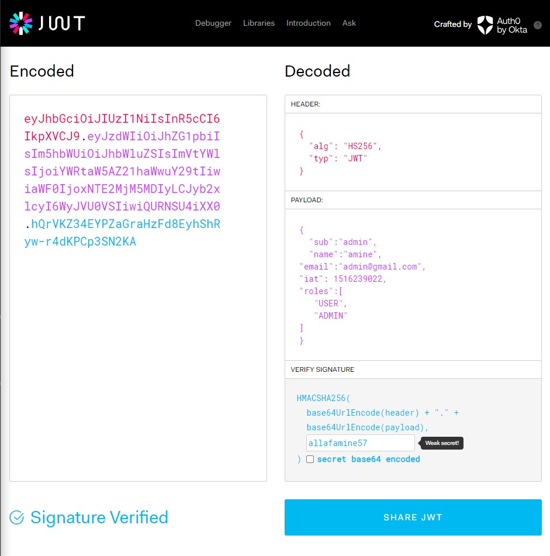
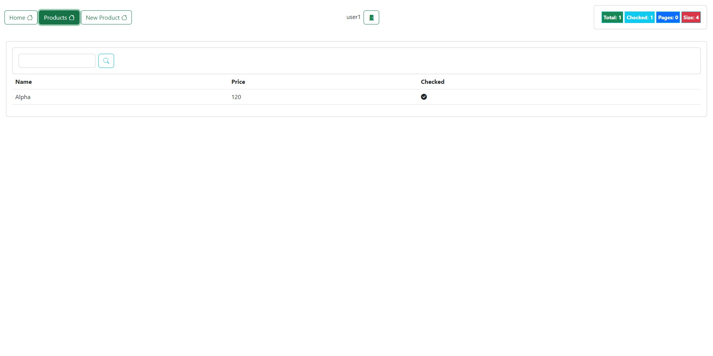

# Angular project with json server
<hr>

<br>

to install json-server run the command :<br>

```markdown
npm i json-server
```

and for json-server-auth we need : <br>

```markdown
npm i json-server-auth
```


and launch json server api by running : <br>

```markdown
json-server -w data/db.json -p 9000
```

<br>

<br>

The JWT I created for admin with roles **'ADMIN'** and **'USER'**



<br>

The login page:


<br>

As an **'ADMIN'**, he can check all products, modify, and delete each of them:


<br>

To create a product, we get this message:


<br>


JWT created for user1 with role **'USER'**


<br>

As a **'USER'**, he can only see the products:



<br>

Once the **'USER'** is trying to create a product, he gets this **"notAuthorized"** page:


