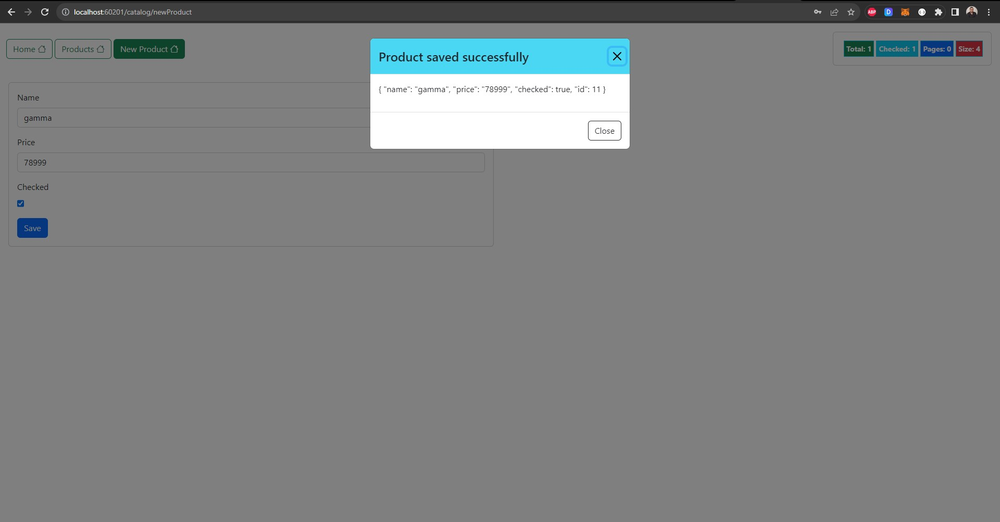
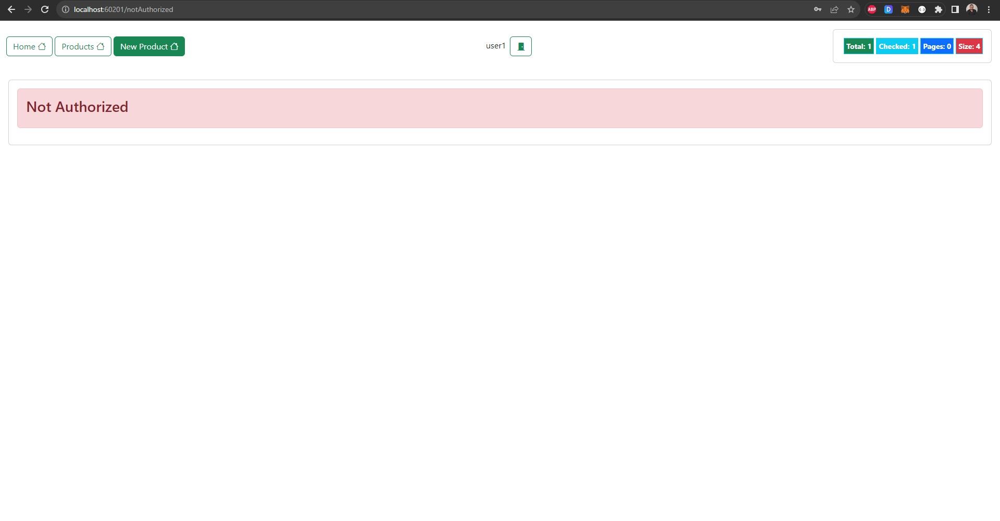

# Angular project with json server

This Angular project is a comprehensive web application that seamlessly integrates with a JSON Server, providing a robust backend for data management. The project leverages the power of Angular, a widely used front-end framework, to create a dynamic and interactive user interface.

## Technologies Used

- **Angular:** The core of the front-end development, Angular facilitates the creation of a modular and scalable structure for the application. It enables the seamless integration of components, services, and routing.

- **JSON Server:** Serving as the backend, JSON Server is utilized to simulate a RESTful API and manage data through a JSON-based database. This simplifies the development process by providing a lightweight and easy-to-use server.

- **JSON Server Auth:** An extension for JSON Server that adds authentication capabilities, ensuring secure access to different parts of the application.

 

The JWT I created for admin with roles **'ADMIN'** and **'USER'**

 

The login page:

 

As an **'ADMIN'**, he can check all products, modify, and delete each of them:

 

To create a product, we get this message:

 

JWT created for user1 with role **'USER'**

 

As a **'USER'**, he can only see the products:

 

Once the **'USER'** is trying to create a product, he gets this **"notAuthorized"** page:

